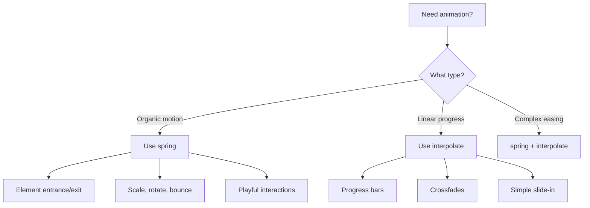

<Note>
  **Impact:** HIGH - Creates natural, organic motion instead of mechanical animations
</Note>

This skill covers using Remotion's `spring()` function to create physics-based animations that feel organic and alive, rather than robotic and linear.

## Prefer spring() Over interpolate()

Use `spring()` for natural motion, `interpolate()` only for linear progress.

<CodeGroup>
```tsx Incorrect (mechanical motion)
const scale = interpolate(frame, [0, 30], [0, 1], {
  extrapolateRight: "clamp",
});
```

```tsx Correct (organic spring motion)
const scale = spring({
  frame,
  fps,
  config: { damping: 12, stiffness: 100 },
  durationInFrames: 30,
});
```
</CodeGroup>

<Tip>
  Springs create subtle overshoot and settling that makes animations feel more natural and less "computed". This small detail makes a huge difference in perceived quality.
</Tip>

## Spring Config Parameters

```tsx
spring({
  frame,
  fps,
  config: {
    damping: 10, // Higher = less bounce (10-200)
    stiffness: 100, // Higher = faster snap (50-200)
    mass: 1, // Higher = more inertia (0.5-3)
  },
});
```

<AccordionGroup>
  <Accordion title="damping" icon="wave-pulse">
    Controls how quickly the spring settles.
    
    - **Low (8-12):** Bouncy, playful, overshoots significantly
    - **Medium (15-20):** Balanced, subtle bounce
    - **High (100-200):** Smooth, minimal overshoot
    
    ```tsx
    damping: 12  // Playful bounce
    damping: 200 // Almost no bounce
    ```
  </Accordion>
  
  <Accordion title="stiffness" icon="gauge-high">
    Controls how quickly the spring accelerates.
    
    - **Low (50-80):** Slow, gentle acceleration
    - **Medium (100-150):** Balanced snap
    - **High (170-200):** Fast, snappy motion
    
    ```tsx
    stiffness: 80  // Gentle
    stiffness: 200 // Snappy
    ```
  </Accordion>
  
  <Accordion title="mass" icon="weight-hanging">
    Controls the "weight" of the animated object.
    
    - **Low (0.5-1):** Light, responsive
    - **Medium (1-1.5):** Natural weight
    - **High (2-3):** Heavy, sluggish
    
    ```tsx
    mass: 0.5  // Light object
    mass: 2    // Heavy object
    ```
  </Accordion>
</AccordionGroup>

## Common Spring Presets

```tsx
// Snappy, minimal bounce (UI elements)
const snappy = { damping: 20, stiffness: 200 };

// Bouncy entrance (playful animations)
const bouncy = { damping: 8, stiffness: 100 };

// Smooth, no bounce (subtle reveals)
const smooth = { damping: 200, stiffness: 100 };

// Heavy, slow (large objects)
const heavy = { damping: 15, stiffness: 80, mass: 2 };
```

<Tabs>
  <Tab title="Snappy">
    ```tsx
    config: { damping: 20, stiffness: 200 }
    ```
    
    **Best for:** UI elements, buttons, toggles, quick interactions
    
    Fast and responsive with minimal overshoot.
  </Tab>
  
  <Tab title="Bouncy">
    ```tsx
    config: { damping: 8, stiffness: 100 }
    ```
    
    **Best for:** Playful animations, attention-grabbing elements, celebrations
    
    Significant overshoot creates energetic feeling.
  </Tab>
  
  <Tab title="Smooth">
    ```tsx
    config: { damping: 200, stiffness: 100 }
    ```
    
    **Best for:** Subtle reveals, professional content, elegant transitions
    
    Almost no bounce, smooth deceleration.
  </Tab>
  
  <Tab title="Heavy">
    ```tsx
    config: { damping: 15, stiffness: 80, mass: 2 }
    ```
    
    **Best for:** Large objects, weighty elements, dramatic entrances
    
    Slow to start and stop, feels substantial.
  </Tab>
</Tabs>

## Delayed Spring Start

Offset the frame for delayed spring animations:

<CodeGroup>
```tsx Incorrect (spring starts immediately)
const entrance = spring({ frame, fps, config: { damping: 12 } });
```

```tsx Correct (spring starts after delay)
const ENTRANCE_DELAY = 20;
const entrance = spring({
  frame: frame - ENTRANCE_DELAY,
  fps,
  config: { damping: 12, stiffness: 100 },
});
// Returns 0 until frame 20, then animates to 1
```
</CodeGroup>

<Note>
  When `frame - ENTRANCE_DELAY` is negative, `spring()` automatically returns 0. This makes delayed starts very simple.
</Note>

## Spring for Scale with Overshoot

For bouncy scale animations that overshoot:

```tsx
const bounce = spring({
  frame,
  fps,
  config: { damping: 8, stiffness: 150 },
});
// Will overshoot past 1.0 before settling

<div style={{ transform: `scale(${bounce})` }}>{content}</div>;
```

<Warning>
  Low damping (8-12) creates overshoot above 1.0. Be aware that elements may temporarily grow larger than their final size.
</Warning>

## Combining Spring with Interpolate

Map spring output (0-1) to custom ranges:

```tsx
const springProgress = spring({ frame, fps, config: { damping: 15 } });

// Map to rotation
const rotation = interpolate(springProgress, [0, 1], [0, 360]);

// Map to position
const translateY = interpolate(springProgress, [0, 1], [50, 0]);

<div style={{ transform: `translateY(${translateY}px) rotate(${rotation}deg)` }}>
```

<Tip>
  This pattern is powerful: use spring for the timing/easing, then map its output to whatever range you need.
</Tip>

## Chained Springs for Sequential Motion

```tsx
const PHASE_1_END = 30;
const PHASE_2_START = 25; // Slight overlap

const phase1 = spring({ frame, fps, config: { damping: 15 } });
const phase2 = spring({
  frame: frame - PHASE_2_START,
  fps,
  config: { damping: 12 },
});

// phase1 controls entrance, phase2 controls secondary motion
```

<Accordion title="Why overlap phases?">
  Starting phase 2 before phase 1 completes creates fluid, continuous motion rather than start-stop-start animation.
</Accordion>

## Key Patterns

<Steps>
  <Step title="Choose Spring Config">
    Match the config to the desired feel:
    - **Playful:** Low damping (8-12)
    - **Professional:** Medium damping (15-20)
    - **Elegant:** High damping (100-200)
  </Step>
  
  <Step title="Delay with Frame Offset">
    ```tsx
    spring({ frame: frame - delay, fps })
    ```
    
    Automatically handles negative values.
  </Step>
  
  <Step title="Map to Custom Range">
    ```tsx
    const s = spring({ frame, fps });
    const custom = interpolate(s, [0, 1], [start, end]);
    ```
  </Step>
</Steps>

## Spring vs Interpolate Decision Tree



## Common Mistakes to Avoid

<Warning>
  **Don't use interpolate for organic animations** - Linear motion looks robotic. Use `spring()` instead.
</Warning>

<Warning>
  **Don't use extreme config values** - Damping over 300 or under 5 creates unnatural motion.
</Warning>

<Warning>
  **Don't forget to delay springs** - For staggered animations, offset the frame: `frame - delay`
</Warning>

<Warning>
  **Don't mix presets inconsistently** - Stick to one "feel" throughout a video (all bouncy OR all smooth).
</Warning>

## Visualizing Spring Behavior

<Frame>
  
</Frame>

<Caption>
  Comparison of different damping values: 8 (bouncy), 15 (balanced), 100 (smooth), 200 (no overshoot)
</Caption>

## Related Skills

<CardGroup cols={3}>
  <Card title="Sequencing" icon="list-timeline" href="/skills/sequencing">
    Delay spring animations
  </Card>
  <Card title="Charts" icon="chart-bar" href="/skills/charts">
    Use springs in bar animations
  </Card>
  <Card title="Messaging" icon="message" href="/skills/messaging">
    Bounce chat bubbles
  </Card>
</CardGroup>